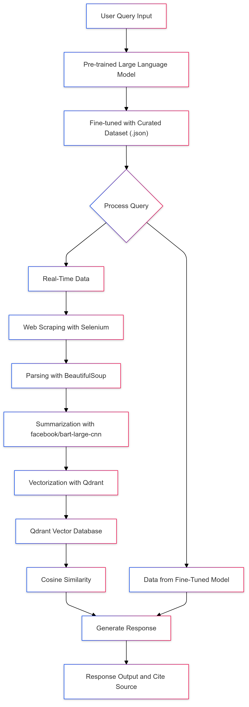

# Capstone'24

**Project Overview**
The Business Operations Assistant Bot is an AI-driven system designed to answer business-related queries by leveraging a fine-tuned Large Language Model (LLM) and a Retrieval-Augmented Generation (RAG) pipeline. This system combines real-time data retrieval, tailored LLM fine-tuning, and document embedding to deliver accurate, contextually enriched responses tailored to business operations topics. Built using Python, it uses various libraries, including Hugging Face Transformers for model operations, LangChain for document handling and vector storage, and Qdrant as a high-performance vector database. The bot’s Streamlit interface provides an interactive platform where users can engage with the assistant and access relevant business insights seamlessly.

**Objective**
The project aims to develop a specialized LLM tailored for the web domain, website - Business World. By fine-tuning the model and integrating real-time data retrieval, the bot is designed to deliver highly relevant responses grounded in recent, accurate business information. This approach addresses the limitations of generic LLMs by enhancing answer specificity and grounding responses in verifiable data sources.

**Approach**

**How the Pipeline Works**:
**Web Scraping and Data Collection**: The bot uses Selenium and BeautifulSoup to scrape real-time data from the “Latest News” section of a designated business website. This section provides current insights relevant to business operations, which the bot uses to create an updated knowledge base. Once scraped, the data is preprocessed for downstream tasks.
**Embedding and Vector Storage**: To enable fast and relevant document retrieval, the bot transforms the text data into numerical vectors using a Hugging Face embedding model (**multi-qa-mpnet-base-dot-v1**). These embeddings capture semantic relationships within the text, making it easier to match user queries with relevant content. The embeddings are stored in Qdrant, a high-performance vector database, which allows efficient similarity search and retrieval.
**Chunking and Contextual Retrieval**: Documents are divided into smaller, manageable chunks (e.g., 512 tokens) using LangChain’s text splitting tools. This chunking strategy helps the bot retrieve the most relevant sections of documents quickly and accurately, optimizing response relevance.
This structure ensures that the bot can search through a vast knowledge base, retrieve the most pertinent information, and use it as a foundation for its answers.

**2. Fine-Tuning the Language Model for Domain Relevance**
The system uses facebook/bart-large-cnn as its foundational LLM, chosen for its capabilities in text summarization and generation. Fine-tuning this model on a curated business-specific dataset enables it to generate contextually accurate answers tailored to business queries.

**Dataset Curation**:
A custom dataset was created in JSON format with (query, context, answer,source) triples, where:
Query represents a typical user question.
Context includes document excerpts or combined texts from real-world business sources.
Answer is the ideal response tailored to the question.
Source is for URL citation of the article from where the answer to query is generated.
Each entry is carefully designed to capture business terminology, specific industry language, and context-relevant phrases. This structure enables the model to learn both domain-specific language patterns and the knowledge required to answer queries accurately.
**Fine-Tuning Process**:
Using Hugging Face’s Transformers library, the model was fine-tuned on the curated dataset to improve its response quality. By training on the (query, context, answer,source) pairs, the model learns to associate specific types of business questions with domain-specific contexts and answers. Training parameters, including learning rate, batch size, and number of epochs, were optimized to ensure effective learning without overfitting. 
In this case, 
**learning_rate=5e-5**,
**per_device_train_batch_size=10**,
**num_train_epochs=30**,
**weight_decay=0.01**
The fine-tuning process produced a model that integrates well with the RAG pipeline, providing responses that align closely with business contexts.
The fine-tuned model is integrated directly into the RAG pipeline, making use of both real-time retrieved documents and the tailored dataset for a dual advantage: up-to-date information and highly relevant, contextually accurate responses.

**3. Real-Time Data Integration and Document Retrieval**
The bot dynamically pulls data from a business news website to keep its knowledge base current.

**Scraping Implementation**: Using Selenium for automation and BeautifulSoup for parsing, the bot scrapes articles from a specific section labeled “Latest News.” This section provides fresh insights and developments relevant to business, enhancing the model’s knowledge base with real-world updates. If the website’s structure changes, the bot has fallback mechanisms to locate relevant sections through alternative selectors, maintaining continuity in data access.

**Embedding and Storage in Qdrant**: Once scraped, each document is converted into an embedding using the **multi-qa-mpnet-base-dot-v1** model. These embeddings are stored in Qdrant, which allows rapid similarity search, enabling the bot to retrieve documents relevant to any incoming query efficiently. The bot’s integration with Qdrant ensures it can quickly process a query, retrieve the top relevant documents, and supply these as context to the model.

This setup combines the power of real-time data with a pre-trained, fine-tuned LLM, ensuring responses are both current and grounded in factual data.

**4. Augmented Response Generation**
The RAG architecture enables the bot to deliver responses that are both accurate and comprehensive.

**Workflow**:

**Query Vectorization**: The user’s query is converted into an embedding, enabling the bot to find semantically similar documents within Qdrant.

**Similarity Check**: In the code, cosine similarity is used to measure the relevance between a user's query and either generated response (from fine-tuned model) or retrieved context (from the vector store). In the function generate_answer_with_fallback, the first step is to generate an initial answer using the fine-tuned model. Before returning this answer, the code checks if it is relevant to the query using cosine similarity. The query and the generated answer are converted into vector embeddings using the base_embeddings model.
Cosine similarity is calculated between the query vector and the response vector. If the similarity exceeds the threshold (0.7), the response is considered relevant and returned.If the initial answer is not relevant, the code retrieves documents (chunks) from the vector store and performs a fallback answer generation using the most relevant context. However, before using a retrieved document, its relevance to the query is checked. If the similarity is below the threshold, the fallback answer generation is skipped, and the bot indicates it could not find a relevant answer.

**Document Retrieval**: The system retrieves the top matches from the vector database, providing the most relevant context for the query.

**LLM Contextual Generation**: Using the fine-tuned model, the bot generates a response based on both the user’s query and the retrieved document chunks. This hybrid approach allows it to provide accurate, context-aware answers that leverage real-world data without drifting into irrelevant or speculative content.
This augmentation step bridges the gap between static model knowledge and dynamic, real-world information, allowing the bot to remain relevant and informative in a rapidly changing domain.

**5. Managing Hallucinations and Ensuring Response Accuracy**
To address potential hallucinations—situations where the model might generate inaccurate or overly confident responses—the bot incorporates several safeguards:

**Grounded Responses**: The model is instructed to generate responses based strictly on retrieved documents, minimizing reliance on inferred knowledge.

**Source Verification**: The retrieved context or snippets are displayed alongside the generated answer, giving users transparency into the data source and an opportunity to verify the response.

**Confidence Thresholds**: By calibrating response generation with metrics such as ROUGE and BLEU, the bot ensures that responses meet a predefined accuracy threshold before being presented to users.
This setup helps mitigate risks associated with model hallucinations, particularly important in a business context where factual accuracy is critical.

**6. Evaluation Metrics: ROUGE and BLEU**
To assess the model’s performance, the bot employs two evaluation metrics:
**ROUGE**: Evaluates how well the generated responses overlap with reference answers by focusing on n-gram and longest common subsequence matching. ROUGE provides insights into both precision and recall, ensuring responses are relevant and contain essential details.
**BLEU**: Measures the fluency and linguistic quality of responses. By assessing n-gram accuracy, BLEU helps ensure that the generated answers are not only factually correct but also grammatically sound and coherent.
Using these metrics allows for a comprehensive evaluation of both the accuracy and readability of the bot’s responses.

**7. User Interaction Through Streamlit Interface**
The bot is accessible through a Streamlit interface where users can input their queries and receive real-time, informed answers. The interface includes:

**URL Input Field**: Allows users to enter the URL of a specific section or site for data scraping.

**Query Field**: Enables users to type in specific business questions.

**Answer Display**: Presents the generated answer along with supporting context from retrieved documents, ensuring transparency.
Streamlit provides a clean, interactive UI, making it easy for users to engage with the bot and access its capabilities directly.

**Data Sources:**
https://www.bworldonline.com/
